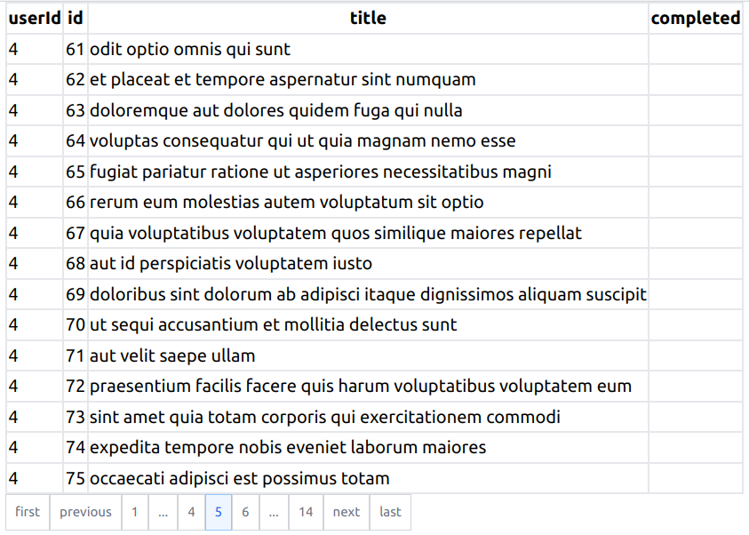
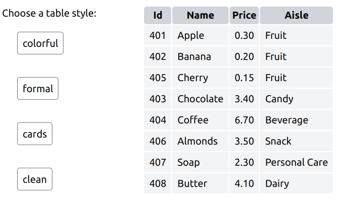

# DataTable
deno component for a dynamic data table based on data object stored in javascript array.

## Examples

## Link to deno.land
https://deno.land/x/datatable

## Usage
~~~js

import { DataTable } from "mod.ts";

  const dataArray = [
    { id: 1, name: "Joe", age: 33 },
    { id: 2, name: "Jane", age: 25 },
  ];

  return (
    <>
        <DataTable dataArray={myData}/>
   </>
  );

~~~
## Features
* Table will automatically update when dataArray is changed.
* Pagination with fixed number of pages
* Table styles

## Related Projects

DataTable:
https://deno.land/x/datatable

PaginoDeno:
https://deno.land/x/paginodeno

d3no-chart:
https://deno.land/x/d3nochart
